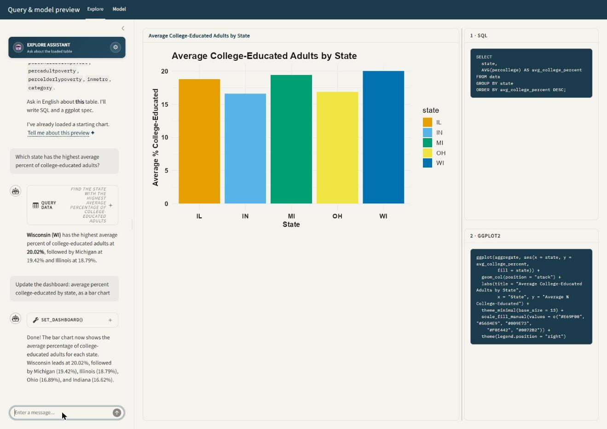
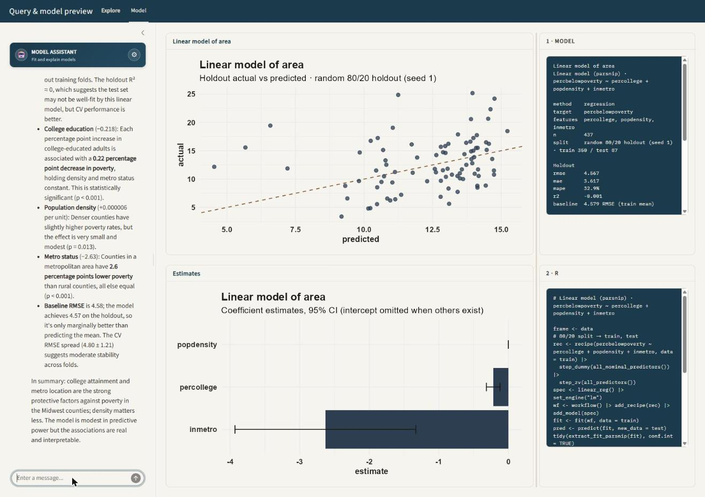

## Overview

Live at [ellmer-practice.ethandbard.com](https://ellmer-practice.ethandbard.com), behind Cloudflare Access on Ethan's own API key. Everyone else runs it locally with their own key — see the [README](https://github.com/ethandbard/ellmer-practice#readme).

ellmer-practice is a two-page Shiny app. Each page pairs a chat panel with a
live preview: type a question in English, and the app turns it into a SQL
query, a model fit, or both. It then redraws the chart and the code pane
beside it.

- **Explore** answers questions with SQL against a DuckDB table and draws a
  ggplot2 chart from the result.
- **Model** fits a small regression, classification, forecast, statistical
  test, or unsupervised model on the same table and draws its diagnostics.

The chat model never sees raw rows. It sees a statistical profile of the
loaded table — each column's role, range, and missingness — and calls one
typed tool per question. R runs the SQL or fits the model, and every session
watches the same DuckDB table.

{fig-alt="Screenshot of the Explore page showing a bar chart of average college-educated adults by state, a chat panel on the left, and SQL and ggplot2 code panels on the right." width="95%"}

## Architecture

### One process, one table, many sessions

`app.R` opens a single file-backed DuckDB connection (`dash_con`) when the
Shiny process starts, and writes the starter dataset into a table named
`data`. Every browser session shares that connection. Loading a new
dataset — a built-in source, an upload, or a file dropped into `data/` —
overwrites table `data` for the whole process, not just the current tab.

A module-level object, `current_source`, tracks the label, column names, row
count, and preview of whatever is currently in table `data`. Each new
session reads `current_source` at startup instead of the original starter
dataset. A second tab, or a reload of the same tab, shows what an earlier
session loaded rather than resetting to the original CSV.

### Two chat clients, one tool contract each

`app.R` creates two [querychat](https://github.com/posit-dev/querychat)
instances, `qc` (Explore) and `qc_ml` (Model), each wrapping its own `ellmer`
chat client. Both point at the same DuckDB connection, so their built-in
`query` tool can run read-only SQL directly. `app.R` then registers
additional tools on each client's underlying chat object:

| Tool | Registered on | Purpose |
| --- | --- | --- |
| `set_dashboard` | Explore | Run up to two SQL queries and redraw the featured chart. |
| `describe_current_chart` | Explore | Describe the chart already on screen without changing it. |
| `describe_data` | Explore, Model | Return the column profile of the loaded table. |
| `set_model` | Model | Fit a model and redraw the Model page. |
| `describe_current_model` | Model | Describe the model already on screen without refitting. |

Each tool's arguments are typed with `ellmer::type_*()` calls in
[R/tools.R](../R/tools.R). The model can only send fields the app knows how
to interpret. Enum fields — geoms, themes, palettes, model methods — are
built from the same registries the renderer uses. Adding a theme or a geom
is one list entry, not a schema edit and a separate renderer edit.

### File map

| File | Role |
| --- | --- |
| `app.R` | Shiny UI, server, data loading, and tool registration. |
| `R/profile.R` | Column profiler: infers a role (measure, count, category, clock, id, text, constant) for every column from its statistics. |
| `R/sql.R` | Runs read-only SQL, auto-picks a starting chart from a table's profile, and holds the plot-spec vocabulary (geoms, sort keys, label formats). |
| `R/plot-recipe.R` | Turns a resolved plot spec into a ggplot2 recipe: a list of unevaluated layer expressions shared by the renderer and the code pane. |
| `R/theme.R` | Theme and palette registries for the featured chart. |
| `R/dashboard-view.R` | Wires the Explore page's SQL results to a plot recipe and formats the tool's return text. |
| `R/tools.R` | Typed tool schemas, sticky style merging, and tool-return formatting shared by both pages. |
| `R/model-tidymodels.R` | tidymodels helpers: workflow builders, prediction, coefficient tidying, partial dependence, tree layout. |
| `R/model-recipe.R` | Model-page plot recipes (one per `plot` key) and the R code shown in the code pane. |
| `R/model-view.R` | Dispatches a model spec to a fitter (`fit_supervised`, `fit_forecast`, `fit_stat_test`, `fit_unsupervised`), and formats the model card. |
| `R/stats-test.R` | `t.test`, ANOVA, chi-square, and correlation, selected from the shape of the two columns given. |
| `R/unsupervised.R` | PCA, k-means, and a pairwise correlation heatmap. |
| `R/providers.R` | Provider and model catalog for Anthropic and xAI, and in-place provider swapping. |
| `R/utils.R` | `%or%`, `empty_to_null()`, and other small helpers shared by every `R/` file. |
| `data/` | Bundled CSVs (`orders.csv`, `food_delivery.csv`, `anscombe-quartet.csv`) plus anything a user uploads. |
| `greeting.md`, `ml-greeting.md` | Static chat greetings shown before the first tool call, so startup does not spend a model call. |
| `extra-instructions.md` | Explore-page system-prompt judgment: when to slice versus break down, how to read a tool's return. |
| `ml-instructions.md` | Model-page system-prompt judgment: which method family answers which question, how to read cross-validation. |
| `tests/testthat/` | Characterization tests for the profiler, resolver, recipes, and tool schemas. |

## Loading data

The settings popover, the gear icon above the chat panel, offers three ways
to change what is in table `data`:

1. A built-in source: the bundled `orders.csv`, or one of `penguins`, `mpg`,
   `diamonds`, `mtcars`, `iris`, `economics`, `txhousing`, `storms`, or
   `midwest` from base R and the tidyverse packages already on the search
   path.
2. Any `.csv`, `.tsv`, `.txt`, or `.parquet` file already in `data/`. A
   2-second `reactivePoll()` picks up a file dropped into the folder, so it
   appears in the dropdown without a restart.
3. A direct upload, copied into `data/` and then loaded the same way as an
   existing local file.

Loading a new source calls `apply_loaded_table()`. It rebuilds the column
profile, refits the system prompts for both chat clients, clears both chat
histories, and reruns the default view and default model. The page never
shows a chart or a model built from the previous table.

## How a question becomes a chart

### The column profile drives the prompt

`R/profile.R` assigns every column a role from its statistics, not its
name: cardinality, integer-ness, sign, and, for date-shaped strings, a
parsed calendar. A column named `id` only becomes role `id` if its
distinct-to-row ratio actually looks like one. An integer column named
`year` becomes a `category`, not a `clock`, unless it also looks like a
Date. Roles feed three things: the auto-chosen starting chart,
`auto_features()` for modeling, and `format_profile_md()`, the markdown
table appended to the system prompt and returned by the `describe_data`
tool.

### The set_dashboard tool contract

On every data question, the Explore chat calls `set_dashboard` exactly
once, sending:

| Argument | Contains |
| --- | --- |
| `title` | A short title for the chart. |
| `detail_sql` | Optional line-item `SELECT` against table `data`. |
| `aggregate_sql` | Optional grouped/summary `SELECT`, every expression aliased. |
| `plot` | The data mapping: `from`, `geom`, `x`, `y`, `color`, facets, sort, and axis labels. |
| `style` | The look: theme, palette, legend position, scales, and value labels. |

`R/sql.R` gates every query through `is_read_only_sql()`. It strips
comments and string literals, then checks for a leading `SELECT` or `WITH`
and rejects write keywords. A legal `WHERE note = 'create'` is not mistaken
for a `CREATE` statement. A follow-up that only restyles the chart —
"make it dark," "add value labels" — omits both SQL fields. The tool
reuses the dashboard's last query results instead of rerunning them.

### Resolving the plot spec

`resolve_plot_spec()` in `R/sql.R` turns the model's raw arguments into a
spec the renderer can trust:

- Column names are matched case-insensitively and punctuation-insensitively
  against both SQL results, so `Order Date` resolves against `order_date`.
- A name that matches neither result is dropped, with a note the tool return
  surfaces back to the model.
- If the model puts a date column on `y` and a number on `x`, the resolver
  swaps them and flips the chart. A clock never ends up scaled like a
  dollar amount.
- An omitted `geom` triggers `auto_spec_from_df()`, which infers a chart
  from the result's shape: a time series if a date and a measure both
  exist, a bar chart for a category and a measure, a histogram otherwise.

### One recipe, two consumers

`plot_recipe()` in `R/plot-recipe.R` does not build a ggplot object. It
builds a list of unevaluated layer expressions, a `plot_recipe`, using
`rlang::expr()`. `render_recipe()` evaluates that list against the plotted
data frame to produce the chart. `deparse_recipe()` prints the same list,
cleaned up by `pretty_r_code()`, as the R shown in the code pane. Both
panes read the same expressions, so the chart and the printed code cannot
drift apart.

### Style is sticky

`R/tools.R` keeps the dashboard's style in a `reactiveValues` object:
theme, palette, accent color, legend position, axis scales, and
value-label formatting. Only the fields present in the current tool call
overwrite it. Style set two questions ago survives until Reset, so "now
make it dark" does not need repeating on every later question. A bare
`highlight` argument survives a mapping change on its own.

## How a question becomes a model

{fig-alt="Screenshot of the Model page showing a linear model's holdout actual-vs-predicted chart, a coefficient estimates chart, a model spec panel, and an R code panel." width="95%"}

### The set_model tool contract

`set_model` takes a single spec. The core fields are `method`, `target`,
`features`, and `prepare_sql`. Method-specific fields cover the rest:
`time_col` and `horizon` for forecasts, `subgroup` for a breakdown, plus
`interactions`, `cv_folds`, `auto_select`, `k`, and `threshold`.

Fields the model omits keep their current value from `mod$result`, through
`merge_model_spec()`. A lone `subgroup = "region"` follow-up re-renders the
existing fit broken down by region, with no refit. `ml-instructions.md`
tells the model this directly: a "break down by region" question is one
call with `subgroup=region`, never one `set_model` call per region.

### Method families

`run_model_request()` in `R/model-view.R` dispatches on `method`:

| `method` | Dispatches to | Notes |
| --- | --- | --- |
| `regression`, `poisson` | `fit_supervised()` | `lm` or a Poisson `glm`, via a `parsnip`/`workflows` pipeline. |
| `classification` | `fit_supervised()` | Logistic `glm` for a 2-level target, multinomial (`nnet`) for 3–12 levels. |
| `ridge`, `elastic` | `fit_supervised()` | `glmnet`, mixture 0 or 0.5. `auto_select=true` on any method fits a lasso (mixture 1) instead. |
| `tree`, `forest` | `fit_supervised()` | `rpart` or `ranger`. Classification mode is inferred if the target has 2 levels. |
| `gam` | `fit_supervised()` | `mgcv`; numeric predictors are wrapped in `s()`. |
| `forecast` | `fit_forecast()` | Holt-Winters, or Holt without a full seasonal cycle, via `stats::HoltWinters()`. |
| `test` | `fit_stat_test()` | Picks `cor.test`, Welch `t.test`, one-way ANOVA, or chi-square/Fisher from the shape of the two columns given. |
| `pca`, `kmeans`, `correlation` | `fit_unsupervised()` | `prcomp`, `stats::kmeans`, and a pairwise `cor()` heatmap. |

Every supervised fit runs through the same pipeline in
`make_supervised_workflow()`: a `recipes::recipe()` with dummy coding for
non-tree engines, a `parsnip` model spec, and a `workflows::workflow()`.
The lasso penalty for `ridge`, `elastic`, and `auto_select` fits comes from
`cv.glmnet()`'s `lambda.1se`, not a fixed default.

::: {layout-ncol="3"}
{fig-alt="ROC curve chart showing true positive rate against false positive rate on the holdout."}

{fig-alt="Decision tree chart with a root split on popdensity and leaf nodes showing predicted values."}

{fig-alt="Scatter plot of k-means cluster assignments on the first two principal components, colored by cluster."}
:::

### Holdout and cross-validation

`split_frame()` in `R/model-tidymodels.R` picks a holdout strategy from the
data:

- A chronological split when the modeling frame has a date column.
- A seeded 80/20 random split otherwise.
- An in-sample fit, clearly labeled, when the table has fewer than 40 rows.

Every reported metric — RMSE, MAE, R², accuracy, AUC — comes from the
holdout, scored against a named baseline. Regression compares to train-mean
RMSE, classification to majority-class accuracy, and forecasts to
last-value or seasonal-naive RMSE. `cv_folds` (default 5, 0 to skip) adds a
second, independent estimate from `rsample::vfold_cv()` on the training
rows only.

### Two panels, one fit

The Model page always shows two charts side by side: an estimates panel
(coefficients, when the fit has them) and a diagnostic panel. Both read the
same fitted `res` object. Switching `plot` on the Model page's tool call
re-renders from the stored fit and does not refit. `secondary_plot_key()`
in `R/model-recipe.R` picks the diagnostic panel's default so it never
repeats the estimates panel. A classification fit defaults to a confusion
matrix; a regression fit defaults to actual-vs-predicted.

## Switching language model providers

`R/providers.R` holds a small catalog of two providers, Anthropic and xAI,
each with an environment variable and a list of models. The app starts on
whichever provider has a key set, preferring Anthropic if both are
present.

Picking a different provider or model in the settings popover calls
`attach_chat_provider()`. It swaps the live `ellmer` chat object's internal
provider in place, so the conversation UI does not need to remount. The
swap reaches into an undocumented `ellmer` field (`private$provider`)
behind a version guard and a `tryCatch()`. A failed swap shows a warning
instead of silently continuing on the old provider.

## Known limitations

- **One shared table per process.** A second browser tab loading a new
  dataset overwrites the first tab's data. This is a single-user preview
  tool, not a multi-tenant app.
- **No second, read-only DuckDB connection.** DuckDB cannot `ATTACH` the
  same file twice for a second reader on Windows. An in-process
  `read_only = TRUE` handle still accepted a `DROP` in testing. SQL safety
  depends entirely on the `is_read_only_sql()` keyword and literal-stripping
  check, not on a database-level permission, and every chat-issued query
  passes through that gate.
- **Large tables are sampled for modeling.** `fit_supervised()` samples down
  to 8,000 rows before fitting. The profile falls back to a 200-row preview
  once a table passes 80,000 rows, so summary statistics on very large
  tables are approximate.
- **The provider swap is version-pinned.** `attach_chat_provider()` requires
  `ellmer` 0.4.2 or later and reaches into a private field. An `ellmer`
  upgrade that renames that field disables in-place provider switching
  until the guard is updated.

## Run the app

1. Add at least one provider key (`ANTHROPIC_API_KEY` or `XAI_API_KEY`) to
   your user `.Renviron` and restart R. See `README.md` for where to get a
   key.
2. From the `ellmer-practice` folder, run `source("setup.R")` to install
   missing packages.
3. Run `shiny::runApp()`, or open `app.R` and click **Run App**.

`tests/testthat/` covers the profiler, the plot-spec resolver, the recipe
builders, and the tool schemas. Run it with
`testthat::test_dir("tests/testthat")` or `devtools::test()`.
